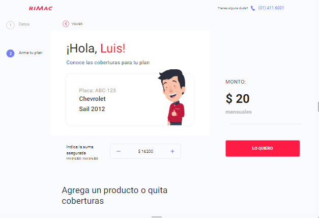
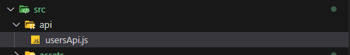

# seguro-vehicular


## Project Description

Application to obtain a quote for a vehicle insurance policy. You can log in using one of these two 'PLACAS':

<span style="font-size: 24px; font-weight: bold;"> ABC-123 or AAA-321.</span>


When accessing the quote page, you'll be able to add or remove vehicle insurance coverages to build your payment plan.


&nbsp


## Used Tools

-  <span>React</span>

-  <span>Redux</span>

-  <span>Material UI</span>

-  <span>Eslint</span>


## Another used packages

- react-router-dom v6

- sweetalert2

- axios

- redux toolkit

## How to use it


1. Clone the repository
```
git clone https://github.com/sazukeR/seguro-vehicular.git
```

2. Move to project folder
```
cd seguro-vehicular
```

3. Install project dependencies
```
npm install
```

4. Run the project
```
npm run dev
```


## JSON-SERVER

You can create your own API and use it in the 'api/' folder. Additionally, you can create a repository on GitHub with JSON-SERVER.

[visit jsonplaceholder](https://jsonplaceholder.typicode.com/)





## MIT License

Copyright (c) 2023 Reinaldo Contreras